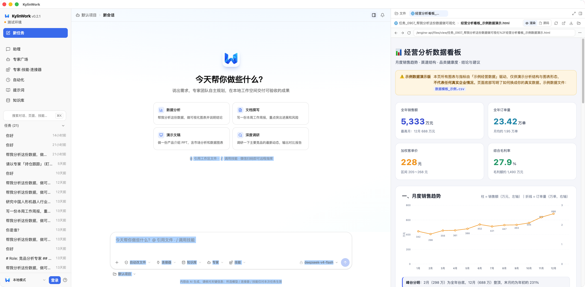

# KylinWork 使用说明

面向使用者的完整操作手册。想先了解它是什么、怎么装，见 [README](../README.md)；本文讲**装好之后怎么用、每一项设置是干什么的、出问题怎么查**。

- [一、第一次打开](#一第一次打开)
- [二、日常怎么用](#二日常怎么用)
- [三、把需求说清楚](#三把需求说清楚)
- [四、模型云服务](#四模型云服务)
- [五、知识库](#五知识库)
- [六、专家与专家团](#六专家与专家团)
- [七、技能](#七技能)
- [八、频道与远程指挥](#八频道与远程指挥)
- [九、连接器与插件](#九连接器与插件)
- [十、自动化：定时任务与推送](#十自动化定时任务与推送)
- [十一、记忆与自进化](#十一记忆与自进化)
- [十二、成果文件与预览](#十二成果文件与预览)
- [十三、权限与安全](#十三权限与安全)
- [十四、命令行（CLI）](#十四命令行cli)
- [十五、数据、备份与重置](#十五数据备份与重置)
- [十六、常见问题排查](#十六常见问题排查)

---

## 一、第一次打开

1. **启动应用**。桌面版双击图标；源码版在仓库目录跑 `npm run app`，或 `npm start` 后用浏览器访问 http://localhost:3800 。
2. **配一个模型**。首次打开会进引导页，选一家服务商，填 API Key。保存前它会**当场发一条真实请求验活**，通过才写入配置——所以填错 Key 不会悄悄存下来。
3. **看到首页**就是就绪了：中间是「今天帮你做什么？」，下面是需求输入框，左侧是功能导航。

如果你只想用本地模型，把 `base_url` 指向 Ollama（`http://localhost:11434/v1`）即可，Key 随便填或留空。

---

## 二、日常怎么用

### 首页

- **四个快捷场景**：数据分析、文档撰写、演示文稿、深度调研。点一下会把示例需求填进输入框，改完直接发。
- **输入框**：写下需求，回车发送（换行用 Shift+回车）。
- **`@` 引用工作区文件**：把已有文件喂给这次任务，例如「@销售数据.xlsx 做成图表」。
- **`/` 调用技能**：显式指定用哪个技能包，例如 `/research-report`。
- **底部一排开关**（从左到右）：`+` 新任务/模式切换、自动改文件（权限档位）、连接器、知识库、专家、技能、模型选择。
- **左侧导航**：新任务、助理、专家广场、专家·技能·连接器、自动化、提示词、知识库；底部显示当前是「本地模式」，可登录同步。
- **搜索**：按 `⌘K` / `Ctrl+K` 搜对话、页面、技能。

### 任务与历史

- 每发一条需求就是**一个任务**，左栏「任务 (N)」里按时间列出，标题取自你的第一句话。
- **多任务并行**：一个任务在跑，照样能新建任务、翻历史。每个任务各跑各的，侧栏挂着转圈标记，点进去能看到它此刻在干什么。
- **不会断**：关窗口、切页面、刷新、重开应用，任务都不中断，回来自动接回直播。
- **失败可重试**：报错时顶部有一条横幅，带「重试 / 检测网络 / 提交反馈」。
- **顶部面包屑**显示当前任务所属项目与需求标题；右侧两个图标分别是分栏与通知。

### 任务模式

输入框左下角 `+` 里切换，也可以在「设置 → 通用」里定默认值：

| 模式 | 什么时候用 |
| --- | --- |
| **Craft · 执行** | 默认。要它动手出活儿时用 |
| **Goal · 目标** | 活儿比较大、想让它自己盯着验收标准补漏时用 |
| **Ask · 问答** | 只问不干，问概念、读代码、看报错 |
| **Plan · 规划** | 先出方案再动手，避免它上来就改文件 |

---

## 三、把需求说清楚

它擅长「一句话 → 一个文件」。经验的写法是**把交付物和口径讲明白**：

```
帮我把 @销售数据.xlsx 做成带图表的 Excel 报表，按区域汇总，另附一段结论
调研一下人形机器人行业最新的竞争格局，输出带图的 Word 报告，10 页左右
做一份 10 页的产品介绍 PPT，风格简约，含市场数据图表
写一个落地页介绍你自己，单文件 HTML，能在本地打开
核算这份试算平衡表，找出账账不符的地方并给出差异归因
```

要点：

- **给材料**：用 `@` 挂上文件，比口头描述准得多。
- **指定格式**：说清要 `.xlsx` 还是 `.docx`、多少页、要不要图。
- **指定口径**：汇总维度、币种、时间范围——它会照做，不说就自己拍。
- **大任务让它先规划**：切到 Plan 模式确认方案，再切回 Craft 执行。

---

## 四、模型云服务

**设置 → 模型云服务**（左侧「模型与智能体」分组下）。

「内置服务商挑一家填 Key 就能开工；启用且配好的会出现在对话的模型选择里。」

- **内置服务商**：OmniLabs、DeepSeek、通义 Qwen、智谱 GLM、Kimi、火山方舟、文心一言、腾讯混元、MiniMax、讯飞星火、商汤商量等，分「官方 / 国产」两组，也可 `+ 自定义服务商` 接任何 OpenAI 兼容网关。
- **每家卡片上的状态**：`待配置` / `缺 API Key` / `N 个模型`，右侧开关控制是否启用。灰着的是没配好的。
- **右侧详情**：
  - **API 地址**：官方地址一键填好，也可自行替换（本地模型填 `http://localhost:11434/v1` 这类）。
  - **API Key**：可显示/隐藏，支持粘贴，旁边是**「检查」**——真发一条请求验活。
  - **模型**：填模型名（如 `deepseek-chat`）回车添加，或点**「获取模型列表」**从服务商拉取。

> 按模型标类型：标成「对话」的进对话的模型选择器；标成「向量 / 重排」的供知识库回收用（见下一节）。
> 本地地址的服务商不需要 Key。

**要接 Ollama 之类本地模型**：`+ 自定义服务商` → API 地址填本地端点 → 加模型名即可，全程不出本机。

---

## 五、知识库

**设置 → 知识库** 配参数，**左侧「知识库」页**建库、传资料。

工作原理：**Embedding** 把文本转成向量做语义召回，**Rerank** 对召回结果精排。检索在 agent 回答时自动发生。

### 模型配置

- **Embedding 模型**（必配）：从模型云服务里**标成「向量」**的模型里选。它同时供「长期记忆」的向量召回使用。旁边「测试」按钮可单独验活。
- **Rerank 模型**（选填）：从**标成「重排」**的模型里选；不配就只做向量召回。

模型本身要在**设置 → 模型云服务**里配：给模型标类型、填好那家服务商的 Key（本地地址免 Key）。

### 检索参数

| 参数 | 含义 | 调它的方向 |
| --- | --- | --- |
| **切块大小（字符）** | 每段入库文本多长 | 默认 800。太大召回不准，太小丢上下文 |
| **切块重叠（字符）** | 相邻块重叠多少，避免切断语义 | 默认 120 |
| **召回条数 top_k** | 每次取回几段 | 默认 6。要更全就调大，但注入会更长 |
| **相似度阈值（低于此分丢弃）** | 低于这个相关度就不给模型 | 默认 0（不过滤）。答得杂就调高 |
| **注入上下文上限（字符）** | 拼进提示词的总长度封顶 | 默认 6000 |

> **改完切块参数后要到知识库页点「重建索引」**，才会对已有资料重跑；否则只影响新入库文件。

### 资料管理

- 支持 **docx / pptx / pdf / md / txt**。
- 入库在**后台队列**里跑，大文件不会把上传请求吊住；失败可重试，重启后接着跑。
- agent 检索后会在界面上告诉你**「这次用了哪条向量模型、走没走向量」**，方便判断是答偏了还是没检索到。

---

## 六、专家与专家团

**设置 → 专家**（也有「专家广场」页可直接挑用）。

「角色设定 + 专属技能，任务里可以被委派。」

内置十位，各带一句定位：

| 专家 | 一句话 |
| --- | --- |
| **持仓跟踪** | 盯得紧。自选股清单、带异动归因的盘后复盘、持仓事件分级提醒 |
| **对公获客** | 找得准。按区域/产业链/园区筛选潜在授信客户，输出营销名单 |
| **固收研究** | 看得稳。债券档案与估值、发行主体信用跟踪、曲线与利差监测 |
| **核算与报告** | 对得上。月结关账检查、总账勾稽、报表一致性核对 |
| **宏观策略** | 望得远。宏观仪表盘、指数估值分位与盈利、仓位与配置建议 |
| **基金研究** | 挑得精。基金筛选、多条件筛选、基金经理画像、持仓风格漂移 |
| **交易测算** | 算得细。并购增厚/摊薄、资金来源与用途、可比交易与融资方案 |
| **经营分析** | 管得住。财务部与 FP&A、管理报表、13 周滚动现金流、预算差异 |
| **企业尽调** | 查得透。尽调报告、关联方与供应链图谱、风险扫描 |
| **权益研究** | 写得深。深度研报、行业分析、财报点评、估值建模 |

- **自己建**：右上角「+ 新建专家」，填角色设定、勾选专属技能、写默认提示词。**存在本机，不登录也能增删**。
- **编辑/删除**：每条右侧两个图标。内置专家改坏了可「恢复默认」。
- **专家团**：把多位专家编成一组，一次派整团按顺序接力，适合一条链上要多个角色的活儿。

用法：在输入框底部选专家，或在需求里点名「请以专家『持仓跟踪』的方式……」。

---

## 七、技能

技能是一个目录 + 一份 Markdown，agent 通过 `use_skill` 按需加载。内置 **72 个**，覆盖投研、财务、固收、基金、宏观、对公获客、企业尽调、文档与设计等。

```
skills/my-skill/
└── SKILL.md        # frontmatter: name / description；正文是给 agent 看的操作指南
```

- **存盘即生效**：不用改代码、不用重启、不用打包。
- **调用**：在输入框打 `/` 选技能，或让 agent 自己判断。
- **管理**：设置 → 技能，可查看、启用/停用。

---

## 八、频道与远程指挥

**设置 → 频道**。「微信扫码、飞书、QQ、企业微信接入——在这些 App 里直接对话。」

| 频道 | 怎么配 | 特点 |
| --- | --- | --- |
| **微信 · 个人号** | 点开后**手机扫码**，登录成功自动回到设置页 | 在微信里给接入的账号发消息，直接跟本机引擎对话，**不需要公网地址** |
| **飞书** | 在飞书开放平台建企业自建应用，拿 **App ID / App Secret** 填进来，「测试并连接」 | 长连接模式，无需公网 |
| **QQ 机器人** | 填官方开放平台的 **App ID / App Secret** | 长连接模式 |
| **企业微信 · 自建应用** | 填对应凭据 | 支持 |
| **公众号 / Webhook** | 见 `config.json` 的 `im.*` | 支持自定义推送 |


**使用效果**：在手机上发一句话，任务在电脑上跑，跑完把结果推回聊天窗口。
配置里 App Secret 那栏「已配置则留空保持不变」——不用每次重填。

> 桌面版窗口失焦时，**任务完成 / 等待审批 / 出错**都会弹系统通知，点通知能把窗口拉回来。

---

## 九、连接器与插件

- **连接器（MCP）**：设置 → 连接器。接入 stdio 或 streamable-http 的 MCP 服务器，其工具自动并入 agent 工具表，对话里直接用。
- **Agent Plugins 1.0**：设置 → 插件。一个目录装齐 `plugin.json` + 技能 + MCP 配置，按 [agent-plugins.org](https://agent-plugins.org) 规范加载。单个组件坏了只跳过它自己，不影响其余部分。

---

## 十、自动化：定时任务与推送

设置 → 自动化（或左侧「自动化」页）。

- **到点自动执行**：每天早上出日报、每周五汇总周报。
- **两种写法**：标准 cron 表达式，或自然语言（「每个工作日早上 8 点」）。
- **结果推送**：企业微信 / 钉钉机器人，或本机系统通知。
- **补跑机制**：睡过头的任务会补跑一次，不会叠加堆积。

---

## 十一、记忆与自进化

- **记忆**分两层：
  - 你手写的偏好（全局生效）——在设置 → 长期记忆里维护；
  - agent 用 `remember` 工具自己记的一条条带归属的条目。
- **自进化**：它会从真实会话里统计「哪类毛病、出现了几次」，据此提出**提示词或规则的修改建议**，经你点头才生效，并按下架门槛淘汰无效改动。设置 → 自进化。

---

## 十二、成果文件与预览



右侧面板就是**交付台**：

- 实时列出本次任务的产物、**标出本轮新增**、体积、修改时间。
- 点开可在**应用内直接预览**：Word / Excel / PPT / PDF / 图片 / 压缩包。Office 三件套在服务端拆成结构化数据再由前端渲染，**不依赖本机装没装 Office**。
- 网页类成果可**一键起本地预览服务**，在浏览器里看真实效果。
- 文件真实落在工作目录里，可在访达 / 资源管理器直接找到、拖走。

---

## 十三、权限与安全

它能在你机器上跑命令，所以闸门是分档的。输入框旁可一键切换：

| 档位 | 写文件 | 跑命令 |
| --- | --- | --- |
| **只看不动** | 禁止 | 禁止（只读探查，适合先看它打算干什么） |
| **每步都问** | 每次确认 | 每次确认 |
| **自动改文件**（默认） | 工作目录内放行 | 按名单，删除 / sudo 之类照样问 |
| **全自动** | 放行 | 放行，仅保留文件黑名单、高危命令二次确认与审计 |

- **任何档位都拦**：文件黑名单、高危命令（`rm -rf`、`sudo`、强推分支等）。
- **全程有审计**：命令与写文件都留痕，可在设置 → 安全中心查看。

---

## 十四、命令行（CLI）

同一套运行时也有 CLI（`bin` 名 `wb`，`npm link` 后可直接用）：

```bash
node engine/cli.js "帮我调研 xxx 并写成报告"   # 单发任务，跑完退出
node engine/cli.js                             # 交互式 REPL
node engine/cli.js -c                          # 接着最近的会话继续
node engine/cli.js -r                          # 列出历史会话，挑一个续接
node engine/cli.js --mode ask "这段报错什么意思"
```

交互模式内建命令：

| 命令 | 作用 |
| --- | --- |
| `/help` | 帮助 |
| `/mode` | 切换任务模式 |
| `/new` | 新会话 |
| `/files` | 看产物 |
| `/sessions` / `/resume` | 列历史 / 续接 |
| `/compact` | 压缩上下文 |
| `/cost` | 看本次花费 |
| `/model` | 切模型 |
| `/exit` | 退出 |

---

## 十五、数据、备份与重置

**数据目录**：

| 跑法 | 位置 |
| --- | --- |
| 桌面版 | `~/KylinWork` |
| 源码跑 | 就是仓库目录 |
| 自定义 | 环境变量 `KYLINWORK_HOME=/你的/路径` |

配置、会话、工作区、技能、插件、备份都在这里。放家目录是有意的：工作区里是要交出去的成果文件，得能直接找到、拖走。

- **备份**：设置 → 备份与缓存，可导出/导入。
- **重置配置**：删掉 `config.json` 等于重置（下次打开会重新进引导页）。
- **全新状态**：全部删掉。
- ⚠️ `workspace/` 里是你的成果文件，别误删。

> **换过运行方式后旧会话打不开？** 历史列表存在浏览器本地，而会话正文按数据目录存。桌面版（`~/KylinWork`）与源码跑（仓库目录）用的是两个目录，所以在一边开的会话在另一边找不到——**换回原来那个数据目录即可，内容没丢。**

---

## 十六、常见问题排查

<details>
<summary><b>macOS 提示「已损坏」或「无法验证开发者」</b></summary>

安装包未做代码签名与公证（需要 Apple 开发者证书），不影响功能。
右键 App →「打开」，或执行 `xattr -dr com.apple.quarantine /Applications/KylinWork.app`。
</details>

<details>
<summary><b>起不来 / 端口被占用</b></summary>

默认端口 `3800`。改 `config.json` 的 `server.port`，或临时 `PORT=3900 npm start`。
启动日志里「模型: xxx」那行没打印出来，通常是 `config.json` 没配好。
</details>

<details>
<summary><b>任务报错「模型调用失败」</b></summary>

在报错横幅上点**「检测网络」**：它会真发一条最小请求问上游，帮你分清是网断了、Key 不对，
还是这个模型本身不可用。也可以在输入框旁的模型选择器里给**当前对话单独**换模型。
</details>

<details>
<summary><b>问答没检索到我的资料</b></summary>

依次检查：① 设置 → 知识库，**Embedding 模型**是否已选且「测试」通过；② 该模型在模型云服务里
是否标成「向量」并填了 Key；③ 库里的资料是否已**入库成功**（失败可重试）；
④ 改过切块参数的话，是否点了**「重建索引」**。
</details>

<details>
<summary><b>某家服务商灰着、显示「缺 API Key」</b></summary>

到设置 → 模型云服务点开那家，填 Key 后点「检查」验活。本地地址的服务商（如 Ollama）不需要 Key。
</details>

<details>
<summary><b>它会不会自己乱跑命令？</b></summary>

不会越档执行。不确定时切到**「只看不动」**再跑一遍，看它打算做什么，全程有审计可查。
</details>

<details>
<summary><b>成果文件在哪？</b></summary>

发生在工作目录内（默认 `~/KylinWork/workspace`），右侧「成果文件」面板实时列出，也可在访达 / 资源管理器里直接打开。
</details>
