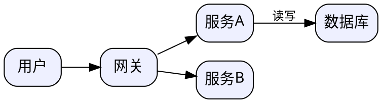

# 数据可视化 / 画图技能

## 铁律：画图用 gen_diagram，不要手写 SVG

手写 SVG 坐标全靠脑算，一画就崩。gen_diagram 是真渲染器（ECharts/Graphviz/mermaid/PlantUML），
输出 `<名字>.svg` + `<名字>.png`（PNG 直接可插飞书/Word/PPT）。

## 选型（按图的内容选 kind）

| 要画什么 | kind | source 写什么 |
|---|---|---|
| 柱状/折线/饼/散点/雷达等数据图表 | `echarts` | ECharts option 对象（JSON 或 JS 字面量） |
| 架构图/依赖图/拓扑图 | `dot` | Graphviz DOT 语法 |
| 流程图/时序图/状态机/甘特/类图/思维导图 | `mermaid` | mermaid 语法 |
| 标准 UML（时序/用例/活动） | `plantuml` | PlantUML 语法（联网或本机装了 plantuml 才行，失败就换 mermaid） |
| 已有 SVG 要转 PNG | `svg` | 完整 `<svg>` 内容 |

离线可靠度：echarts = dot（纯本地）＞ mermaid（应用内本地）＞ plantuml（可能要联网）。拿不准就用 dot/echarts。

## echarts 模板要点

```js
{ title: { text: "Q3 华东区销量领先", left: "center" },
  tooltip: {}, legend: { bottom: 0 },
  xAxis: { type: "category", data: ["7月","8月","9月"] },
  yAxis: { type: "value", name: "万元" },
  series: [{ type: "bar", data: [120, 200, 150], itemStyle: { color: "#5b5ff7" } }] }
```
- 配色统一用：#5b5ff7 #8b5cf6 #22c55e #f59e0b #ef4444，一张图 ≤4 色
- 标题直接写洞察（"Q3 华东区销量领先"而非"销量图"）；数字千分位；坐标轴带单位

## dot（架构图）要点


中文必须给 node/edge 设 `fontname="PingFang SC"`，否则可能变方框。

## mermaid 要点

- 流程 `graph LR`、时序 `sequenceDiagram`、甘特 `gantt`、状态 `stateDiagram-v2`
- 节点文字含中文/括号时用引号：`A["用户下单(App)"]`

## 交付形态

1. **插入文档**：gen_diagram 生成后，在 feishu_doc_create 的 markdown 里独占一行写 `` 即真插图；Word/PPT 也用 PNG
2. **交互式大图表**：单文件 HTML + ECharts CDN（`https://cdn.jsdelivr.net/npm/echarts@5/dist/echarts.min.js`），适合仪表盘类交付
3. 图表下方补一行数据来源/口径说明

## 质量标准
- 一图一结论；能看清（文字 ≥11px）；PNG 已是 2 倍清晰度不用再缩放
